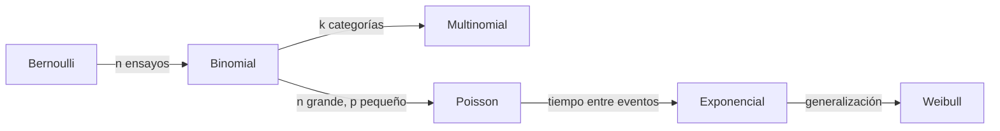

# Distribuciones de Probabilidad 📊

## Modelando decisiones en Marketing Digital

Unidad II - Estadística Aplicada

<div v-click class="text-sm opacity-75 mt-6">
Datos reales • Modelos matemáticos • Decisiones estratégicas
</div>

---
layout: presenter
presenterImage: 'https://media.giphy.com/media/v1.Y2lkPTc5MGI3NjExbXl0ZnZ3OGE4N3BqYnUyZjZjNXJ3YmY3YnM3YjZ3ZnZ3YmY3YnM3YiZlcD12MV9naWZzX3NlYXJjaCZjdD1n/3oKIPEqDGUULpEU0aQ/giphy.gif'
---

# Introducción 🎯

<v-clicks>

Las **distribuciones de probabilidad** son el puente entre datos y decisiones

En marketing digital permiten:
- Predecir comportamientos de usuarios
- Dimensionar recursos técnicos
- Optimizar presupuestos publicitarios
- Gestionar riesgos operativos

**Caso central:** Agencia de marketing digital que monitorea clics, conversiones, tiempos de interacción y errores técnicos

</v-clicks>

---
layout: text-image
media: 'https://media.giphy.com/media/v1.Y2lkPTc5MGI3NjExYWJjZGVmZ2hpamtsbW5vcHFyc3R1dnd4eXphYmNkZWZnaGlqa2xtbiZlcD12MV9naWZzX3NlYXJjaCZjdD1n/xT9IgzoKnwFNmISR8I/giphy.gif'
transition: slide-up
zoom: 0.8
---

# Tipos de Distribuciones 🔍

<div class="text-sm opacity-75 mb-4">
Clasificación según la naturaleza de la variable aleatoria
</div>

<v-clicks depth="2">

- **Distribuciones Discretas** 🎲
  - Variables que toman valores contables
  - Ejemplos: número de clics, conversiones, errores
  - Gráficos: barras, diagrama de frecuencias

- **Distribuciones Continuas** 📈
  - Variables que toman cualquier valor en un rango
  - Ejemplos: tiempo en página, duración de sesión
  - Gráficos: histogramas con curvas

</v-clicks>

---
layout: intro
class: text-center
---

# PARTE I

## Distribuciones Discretas 🎲

<div v-after class="text-sm opacity-75 mt-4">
Bernoulli • Binomial • Multinomial • Poisson
</div>

---
layout: text-image
media: 'https://media.giphy.com/media/v1.Y2lkPTc5MGI3NjExcXdlcnR5dWlvcGFzZGZnaGprbHp4Y3Zibm1xd2VydHl1aW9wYXNkZiZlcD12MV9naWZzX3NlYXJjaCZjdD1n/YVPwi7L2izTJS/giphy.gif'
reverse: true
zoom: 0.8
---

# 1. Distribución de Bernoulli 🎯

<div class="mb-4">
<strong>Contexto:</strong> Usuario ve anuncio → Hace clic o NO hace clic
</div>

<v-clicks>

**Características:**
- Solo 2 resultados posibles
- Éxito (1) con probabilidad $p$
- Fracaso (0) con probabilidad $1-p$

**Fórmula:**

$$P(X = x) = p^x (1-p)^{1-x}, \quad x \in \{0,1\}$$

**Ejemplo:** CTR = 8%
- $P(\text{clic}) = 0.08$
- $P(\text{no clic}) = 0.92$

</v-clicks>

---
zoom: 0.9
---

# 2. Distribución Binomial 📊

<div class="grid grid-cols-2 gap-6">

<div>

<v-clicks depth="2">

**Definición:**
- $n$ ensayos independientes de Bernoulli
- Cuenta número de **éxitos**

**Fórmula:**

$$P(X = k) = \binom{n}{k} p^k (1-p)^{n-k}$$

**Parámetros:**
- $n$: número de ensayos
- $p$: probabilidad de éxito

</v-clicks>

</div>

<div>

<v-click>

**Caso práctico:**

Anuncio mostrado a **10 usuarios** con CTR = 8%

¿Probabilidad de exactamente 2 clics?

$$P(X=2) = \binom{10}{2}(0.08)^2(0.92)^8$$

$$= 45 \times 0.0064 \times 0.5132$$

$$= \boxed{0.1478 \text{ o } 14.78\%}$$

</v-click>

</div>

</div>

<v-click>

<div class="mt-4 p-3 bg-blue-50 rounded text-sm">
💡 <strong>Aplicación:</strong> Planificar cuántos clics esperar en campañas con audiencias fijas
</div>

</v-click>

---
layout: text-window
---

# 3. Distribución Multinomial 🎨

<div class="text-lg mb-4">
Extensión de binomial para <strong>más de 2 categorías</strong>
</div>

::window::

**Contexto:** Un anuncio genera 3 respuestas:
- 🖱️ Clic (p₁ = 0.08)
- 👁️ Visualización sin clic (p₂ = 0.85)
- 🚫 Reporte spam (p₃ = 0.07)

**Fórmula:**

$$P(X_1=x_1, X_2=x_2, X_3=x_3) = \frac{n!}{x_1! x_2! x_3!} p_1^{x_1} p_2^{x_2} p_3^{x_3}$$

---

<v-click>

**Ejemplo:** 20 usuarios, ¿probabilidad de 2 clics, 17 vistas, 1 spam?

$$P = \frac{20!}{2! \cdot 17! \cdot 1!} (0.08)^2(0.85)^{17}(0.07)^1$$

$$= 1140 \times 0.0064 \times 0.0631 \times 0.07$$

$$= \boxed{0.0323 \text{ o } 3.23\%}$$

</v-click>

---
layout: text-image
media: 'https://r-coder.com/images/featured/poisson-distribution-r.png'
zoom: 0.8
---

# 4. Distribución de Poisson ⚡

<v-clicks depth="2">

**Contexto:** Conversiones por hora en landing page

**Características:**
- Eventos **raros** en intervalo fijo
- Tasa promedio conocida: $\lambda$
- Eventos independientes

**Fórmula:**

$$P(X = k) = \frac{e^{-\lambda} \lambda^k}{k!}$$

**Ejemplo:** $\lambda = 5$ conversiones/hora

¿Probabilidad de exactamente 3 conversiones?

$$P(X=3) = \frac{e^{-5} \cdot 5^3}{3!} = \frac{0.006738 \times 125}{6} \approx \boxed{0.1404}$$

</v-clicks>

---
layout: center
---

# 📊 Contraste Binomial: Validación del CTR

<v-click>

<div class="bg-gradient-to-r from-blue-50 to-purple-50 p-6 rounded-lg">

**Prueba de Hipótesis:**

$$H_0: p = 0.08 \text{ (CTR esperado)}$$
$$H_1: p \neq 0.08$$

**Criterio:** Si $p\text{-valor} < 0.05$ → Rechazar $H_0$

<div class="mt-4 grid grid-cols-2 gap-4">

<div class="bg-white p-3 rounded">
<strong>Si se rechaza:</strong>
- Investigar cambios en audiencia
- Verificar fraude de clics
- Analizar calidad del anuncio
</div>

<div class="bg-white p-3 rounded">
<strong>Si NO se rechaza:</strong>
- Campaña funciona según lo esperado
- Mantener estrategia actual
- Monitoreo continuo
</div>

</div>

</div>

</v-click>

---
layout: intro
class: text-center
transition: slide-left
---

# PARTE II

## Distribuciones Continuas 📈

<div v-after class="text-sm opacity-75 mt-4">
Normal • Exponencial • Weibull
</div>

---
zoom: 0.85
---

# 5. Distribución Normal 🔔

<div class="grid grid-cols-2 gap-6">

<div>

<v-clicks depth="2">

**La "campana de Gauss"**

**Características:**
- Simétrica respecto a la media $\mu$
- Dispersión medida por $\sigma$
- 68% datos en $[\mu-\sigma, \mu+\sigma]$
- 95% datos en $[\mu-2\sigma, \mu+2\sigma]$

**Fórmula de densidad:**

$$f(x) = \frac{1}{\sigma\sqrt{2\pi}} e^{-\frac{(x-\mu)^2}{2\sigma^2}}$$

</v-clicks>

</div>

<div>

<v-click>

**Caso práctico:**

Tiempo en landing page:
- $\mu = 120$ segundos
- $\sigma = 30$ segundos

¿Probabilidad de > 150 segundos?

**Estandarización:**

$$Z = \frac{150-120}{30} = 1$$

$$P(X > 150) = P(Z > 1)$$
$$= 1 - 0.8413 = \boxed{0.1587}$$

**≈ 15.87%** de usuarios

</v-click>

</div>

</div>

---
layout: text-image
media: 'https://media.giphy.com/media/v1.Y2lkPTc5MGI3NjExenh2Y2JuYW1xd2VydHl1aW9wYXNkZmdoamtsenhjdmJubXF3ZXJ0eSZlcD12MV9naWZzX3NlYXJjaCZjdD1n/3o7btPCcdNniyf0ArS/giphy.gif'
reverse: true
zoom: 0.8
---

# 6. Distribución Exponencial ⏱️

<v-clicks>

**Contexto:** Tiempo **entre** conversiones

**Propiedad clave:** Sin memoria
- El pasado no afecta el futuro
- Ideal para eventos aleatorios

**Parámetro:** Tasa $\lambda$ (eventos por unidad de tiempo)

**Fórmula de supervivencia:**

$$P(X > x) = e^{-\lambda x}$$

**Ejemplo:** Conversión cada 12 min ($\lambda = 1/12$)

¿Probabilidad de esperar > 20 min?

$$P(X > 20) = e^{-(1/12) \times 20} = e^{-1.667} \approx \boxed{0.1889}$$

</v-clicks>

---
zoom: 0.9
---

# 7. Distribución de Weibull 🌐

<v-click>

<div class="bg-gradient-to-r from-purple-50 to-pink-50 p-4 rounded-lg mb-4">
<strong>La distribución más flexible para tiempos</strong>
</div>

</v-click>

<div class="grid grid-cols-2 gap-4">

<div>

<v-clicks depth="2">

**Parámetros:**
- $k$: forma (controla el tipo de curva)
- $\lambda$: escala (valor típico)

**Casos especiales:**
- $k < 1$: Tasa decreciente (abandono inicial)
- $k = 1$: **Exponencial**
- $k > 1$: Tasa creciente (desgaste)
- $k \approx 3.4$: Similar a Normal

**Fórmula:**

$$P(X > x) = e^{-(x/\lambda)^k}$$

</v-clicks>

</div>

<div>

<v-click>

**Caso práctico:**

Duración de sesiones:
- $k = 1.5$
- $\lambda = 100$ segundos

¿Probabilidad de sesión > 150 seg?

$$P(X > 150) = e^{-(150/100)^{1.5}}$$

$$= e^{-(1.5)^{1.5}} = e^{-1.837}$$

$$\approx \boxed{0.159 \text{ o } 15.9\%}$$

</v-click>

<v-click>

<div class="mt-4 p-3 bg-yellow-50 rounded text-sm">
🔧 <strong>Uso:</strong> Análisis de confiabilidad de servidores, tiempo hasta abandono
</div>

</v-click>

</div>

</div>

---
layout: center
transition: fade
---

# 📊 Tabla Resumen: Distribuciones

<table class="w-full text-sm">
<thead>
<tr class="bg-gradient-to-r from-blue-100 to-purple-100">
<th class="p-2">Distribución</th>
<th class="p-2">Tipo</th>
<th class="p-2">Parámetros</th>
<th class="p-2">Caso de uso</th>
</tr>
</thead>
<tbody>

<tr v-click="1" class="border-b hover:bg-blue-50">
<td class="p-2 font-bold">Bernoulli</td>
<td class="p-2">Discreta</td>
<td class="p-2">p</td>
<td class="p-2">Clic vs no clic</td>
</tr>

<tr v-click="2" class="border-b hover:bg-green-50">
<td class="p-2 font-bold">Binomial</td>
<td class="p-2">Discreta</td>
<td class="p-2">n, p</td>
<td class="p-2">Número de clics en n impresiones</td>
</tr>

<tr v-click="3" class="border-b hover:bg-yellow-50">
<td class="p-2 font-bold">Multinomial</td>
<td class="p-2">Discreta</td>
<td class="p-2">n, p_1, ..., p_k</td>
<td class="p-2">Tipos de interacción (clic/view/spam)</td>
</tr>

<tr v-click="4" class="border-b hover:bg-red-50">
<td class="p-2 font-bold">Poisson</td>
<td class="p-2">Discreta</td>
<td class="p-2">\lambda</td>
<td class="p-2">Conversiones por hora</td>
</tr>

<tr v-click="5" class="border-b hover:bg-purple-50">
<td class="p-2 font-bold">Normal</td>
<td class="p-2">Continua</td>
<td class="p-2">\mu, \sigma</td>
<td class="p-2">Tiempo en página, ingresos</td>
</tr>

<tr v-click="6" class="border-b hover:bg-pink-50">
<td class="p-2 font-bold">Exponencial</td>
<td class="p-2">Continua</td>
<td class="p-2">\lambda</td>
<td class="p-2">Tiempo entre conversiones</td>
</tr>

<tr v-click="7" class="border-b hover:bg-orange-50">
<td class="p-2 font-bold">Weibull</td>
<td class="p-2">Continua</td>
<td class="p-2">k, \lambda</td>
<td class="p-2">Duración sesión, tiempo hasta fallo</td>
</tr>

</tbody>
</table>

---
layout: intro
class: text-center
---

# PARTE III

## Ejercicios Aplicados 🧮

<div v-after class="text-sm opacity-75 mt-4">
Casos reales con soluciones paso a paso
</div>

---
zoom: 0.85
---

# Ejercicio 1: Al menos 1 conversión 🎯

<v-click>

**Contexto:** Tasa de conversión = 5%, 20 visitas

¿Probabilidad de **al menos 1 conversión**?

</v-click>

<div class="grid grid-cols-2 gap-4 mt-4">

<div>

<v-click>

**Método 1: Binomial (exacto)**

$$P(X \geq 1) = 1 - P(X = 0)$$

$$P(X = 0) = \binom{20}{0}(0.05)^0(0.95)^{20}$$

$$= (0.95)^{20} \approx 0.3585$$

$$P(X \geq 1) = 1 - 0.3585$$

$$= \boxed{0.6415 \text{ o } 64.15\%}$$

</v-click>

</div>

<div>

<v-click>

**Método 2: Aproximación Poisson**

$$\lambda = np = 20 \times 0.05 = 1$$

$$P(X = 0) = \frac{e^{-1} \cdot 1^0}{0!} = e^{-1}$$

$$\approx 0.3679$$

$$P(X \geq 1) = 1 - 0.3679$$

$$= \boxed{0.6321 \text{ o } 63.21\%}$$

</v-click>

</div>

</div>

<v-click>

<div class="mt-4 p-3 bg-green-50 rounded">
💼 <strong>Decisión:</strong> En 2 de cada 3 campañas de 20 visitas esperamos al menos 1 conversión
</div>

</v-click>

---
zoom: 0.5
transition: fade
---

<div style="display: flex; justify-content: center;">
  <div v-click>
    
  </div>
</div>

---

# Ejercicio 2: Tiempo entre clics ⏰

<v-click>

**Contexto:** Tiempo promedio entre clics = 8 segundos

¿Probabilidad de esperar **más de 15 segundos**?

</v-click>

<v-click>

**Distribución:** Exponencial con $\lambda = \frac{1}{8} = 0.125$ clics/seg

</v-click>

<v-click>

$$P(X > 15) = e^{-\lambda x} = e^{-0.125 \times 15}$$

$$= e^{-1.875} \approx \boxed{0.1531 \text{ o } 15.31\%}$$

</v-click>

<v-click>

<div class="mt-6 p-4 bg-blue-50 rounded">

**Aplicaciones administrativas:**

- 🖥️ **Optimización de servidor:** 15% del tiempo hay más de 15 seg sin clics → recursos ociosos
- 🚨 **Detección de problemas:** Si este % aumenta drásticamente, posible fallo en campaña
- 📊 **Planificación de capacidad:** Dimensionar recursos para picos y valles

</div>

</v-click>

---
zoom: 0.8
transition: fade
---

<div style="display: flex; justify-content: center;">
  <div v-click>
    
  </div>
</div>

---
zoom: 0.85
---

# Ejercicio 3: Clientes Premium 💰

<v-click>

**Contexto:** Ingresos por cliente ~ Normal($\mu = \$45$, $\sigma = \$10$)

¿Qué % de clientes genera **más de $60**?

</v-click>

<div class="grid grid-cols-2 gap-6 mt-4">

<div>

<v-click>

**Estandarización:**

$$Z = \frac{60 - 45}{10} = 1.5$$

$$P(X > 60) = P(Z > 1.5)$$

$$= 1 - P(Z \leq 1.5)$$

$$= 1 - 0.9332$$

$$= \boxed{0.0668 \text{ o } 6.68\%}$$

</v-click>

</div>

<div>

<v-click>

**Estrategia de Segmentación:**

<div class="space-y-2 text-sm">

- 🏆 **Top 6.68%** → Clientes VIP (>$60)
- 📈 **Top 10%** → $Z = 1.28$
  - $X = 45 + 1.28(10) = \$57.80$
- 📊 **Top 25%** → $Z = 0.674$
  - $X = 45 + 0.674(10) = \$51.74$

</div>

</v-click>

</div>

</div>

<v-click>

<div class="mt-4 p-3 bg-purple-50 rounded text-sm">
💡 <strong>Acción:</strong> Crear programa de lealtad para top 10%, analizar características comunes, calcular LTV diferenciado
</div>

</v-click>

---
zoom: 0.8
transition: fade
---

<div style="display: flex; justify-content: center;">
  <div v-click>
    
  </div>
</div>

---
layout: text-image
media: 'https://media.giphy.com/media/v1.Y2lkPTc5MGI3NjExYXNkZmdoamtsenhjdmJubXF3ZXJ0eXVpb3Bhc2RmZ2hqa2x6eGN2YiZlcD12MV9naWZzX3NlYXJjaCZjdD1n/xT9C25UNTwfZuk85WP/giphy.gif'
zoom: 0.8
---

# Ejercicio 4: Weibull vs Exponencial 🔧

<v-clicks>

**¿Cuándo preferir Weibull?**

**Respuesta:** Cuando la **tasa de eventos cambia con el tiempo**

**Casos específicos:**

1. **Desgaste de sistemas** ($k > 1$)
   - Servidores que fallan más con el tiempo
   - Usuarios con mayor abandono tras inactividad

2. **Adopción inicial** ($k < 1$)
   - Alta fuga inicial que se estabiliza
   - Productos con curva de aprendizaje

3. **Exponencial** ($k = 1$): Tasa constante, sin memoria

</v-clicks>

---
zoom: 0.7
transition: fade
---

<div style="display: flex; justify-content: center;">
  <div v-click>
    
  </div>
</div>

---
layout: center
---

# 📊 Análisis Visual de Datos

<div v-motion
  :initial="{ opacity: 0, y: 20 }"
  :enter="{ opacity: 1, y: 0 }"
  class="text-center">

<v-click>

## Validación de Distribuciones mediante Gráficos

</v-click>

<v-click>

<div class="grid grid-cols-3 gap-4 mt-8">

<div class="bg-blue-50 p-4 rounded">
<h3 class="font-bold text-blue-700">Normal</h3>
<p class="text-sm">Curva simétrica</p>
<p class="text-sm">Campana centrada</p>
</div>

<div class="bg-green-50 p-4 rounded">
<h3 class="font-bold text-green-700">Exponencial</h3>
<p class="text-sm">J invertida</p>
<p class="text-sm">Pico al inicio</p>
</div>

<div class="bg-purple-50 p-4 rounded">
<h3 class="font-bold text-purple-700">Weibull</h3>
<p class="text-sm">Asimétrica derecha</p>
<p class="text-sm">Pico tras el inicio</p>
</div>

</div>

</v-click>

</div>

---
zoom: 0.7
transition: fade
---

<div style="display: flex; justify-content: center;">
  <div v-click>
    
  </div>
</div>

---
zoom: 0.85
---

# Estadísticas Descriptivas: Diagnóstico 🔍

<v-click>

<div class="bg-gradient-to-r from-blue-50 to-purple-50 p-4 rounded mb-4">
<strong>Checklist de validación de distribuciones</strong>
</div>

</v-click>

<table class="w-full text-sm">
<thead>
<tr class="bg-gray-100">
<th class="p-2">Variable</th>
<th class="p-2">Asimetría</th>
<th class="p-2">Curtosis</th>
<th class="p-2">Distribución</th>
</tr>
</thead>
<tbody>

<tr v-click="2" class="border-b">
<td class="p-2 font-mono">time_on_page</td>
<td class="p-2">≈ 0</td>
<td class="p-2">≈ 3</td>
<td class="p-2 font-bold text-blue-700">✓ Normal</td>
</tr>

<tr v-click="3" class="border-b">
<td class="p-2 font-mono">conversions_per_hour</td>
<td class="p-2">> 0</td>
<td class="p-2">> 3</td>
<td class="p-2 font-bold text-green-700">✓ Poisson</td>
</tr>

<tr v-click="4" class="border-b">
<td class="p-2 font-mono">time_between_conversions</td>
<td class="p-2">>> 0</td>
<td class="p-2">Alta</td>
<td class="p-2 font-bold text-red-700">✓ Exponencial</td>
</tr>

<tr v-click="5" class="border-b">
<td class="p-2 font-mono">session_duration</td>
<td class="p-2">> 0</td>
<td class="p-2">Moderada</td>
<td class="p-2 font-bold text-purple-700">✓ Weibull</td>
</tr>

</tbody>
</table>

<v-click at="6">

<div class="mt-4 grid grid-cols-2 gap-4 text-xs">

<div class="bg-yellow-50 p-3 rounded">
<strong>Asimetría:</strong>
- |As| < 0.5 → Simétrica
- As > 1 → Sesgada derecha
- As < -1 → Sesgada izquierda
</div>

<div class="bg-pink-50 p-3 rounded">
<strong>Curtosis:</strong>
- K = 3 → Normal (mesocúrtica)
- K > 3 → Leptocúrtica (puntiaguda)
- K < 3 → Platicúrtica (plana)
</div>

</div>

</v-click>

---
zoom: 0.7
transition: fade
---

<div style="display: flex; justify-content: center;">
  <div v-click>
    
  </div>
</div>

---
layout: text-window
---

# Frecuencias Multinomial: Monitoreo 📈

<div class="text-sm mb-4">
Tabla de frecuencias para interaction_type (click, view, spam_report)
</div>

::window::

<v-click>

**KPIs derivados de frecuencias:**

```python
Engagement Rate = (Clicks + Views) / Total
Spam Rate = Spam_reports / Total
Click-Through Rate = Clicks / Total
```

</v-click>

<v-click>

**Sistema de alertas:**

🟢 **NORMAL:** spam_rate < 1%
🟡 **ADVERTENCIA:** 1% ≤ spam_rate < 5%
🔴 **CRÍTICO:** spam_rate ≥ 5%

</v-click>

<v-click>

**Acciones según spam_rate:**

- Si **> 5%**: Anuncio irrelevante o engañoso
- Revisar segmentación de audiencia
- Analizar contenido y promesa del anuncio
- Comparar con industria (benchmark)

</v-click>

---
zoom: 0.7
transition: fade
---

<div style="display: flex; justify-content: center;">
  <div v-click>
    
  </div>
</div>

---
layout: center
transition: slide-up
---

# 🔗 Relación entre Distribuciones

<div v-motion
  :initial="{ scale: 0.8 }"
  :enter="{ scale: 1 }"
  class="mt-8">

<v-click>



</v-click>

<v-click>

<div class="mt-6 p-4 bg-gradient-to-r from-blue-50 to-purple-50 rounded">

**Insight clave:** Si conversiones siguen **Poisson en el tiempo**, entonces los **tiempos entre conversiones** son **Exponenciales**

$$\text{Eventos } \sim \text{Poisson}(\lambda) \iff \text{Tiempos} \sim \text{Exponencial}(\lambda)$$

</div>

</v-click>

</div>

---
zoom: 0.7
transition: fade
---

<div style="display: flex; justify-content: center;">
  <div v-click>
    
  </div>
</div>

---
layout: intro
class: text-center
transition: slide-right
---

# Conclusiones y Aplicaciones 🎯

<div v-after class="text-sm opacity-75 mt-4">
Del modelo matemático a la decisión estratégica
</div>

---
zoom: 0.9
transition: slide-down
---

# Conclusiones Clave 💡

<div class="grid grid-cols-2 gap-4">

<v-click at="1">
<div class="bg-blue-50 p-4 rounded">
<h3 class="font-bold text-blue-700 mb-2">1. Discretas para contar</h3>
<p class="text-sm">Clics, conversiones, errores, categorías de respuesta</p>
</div>
</v-click>

<v-click at="2">
<div class="bg-green-50 p-4 rounded">
<h3 class="font-bold text-green-700 mb-2">2. Continuas para medir</h3>
<p class="text-sm">Tiempos, duraciones, ingresos, métricas continuas</p>
</div>
</v-click>

<v-click at="3">
<div class="bg-purple-50 p-4 rounded">
<h3 class="font-bold text-purple-700 mb-2">3. Predicción de comportamientos</h3>
<p class="text-sm">Probabilidades permiten anticipar resultados y escenarios</p>
</div>
</v-click>

<v-click at="4">
<div class="bg-orange-50 p-4 rounded">
<h3 class="font-bold text-orange-700 mb-2">4. Dimensionamiento de recursos</h3>
<p class="text-sm">Servidores, personal, presupuestos basados en modelos</p>
</div>
</v-click>

<v-click at="5">
<div class="bg-pink-50 p-4 rounded">
<h3 class="font-bold text-pink-700 mb-2">5. Weibull: La más flexible</h3>
<p class="text-sm">k=1 → Exponencial | k=2 → Rayleigh | k≈3.4 → Normal</p>
</div>
</v-click>

<v-click at="6">
<div class="bg-yellow-50 p-4 rounded">
<h3 class="font-bold text-yellow-700 mb-2">6. Validación visual y numérica</h3>
<p class="text-sm">Histogramas + Asimetría/Curtosis confirman el modelo</p>
</div>
</v-click>

</div>

---
layout: presenter
presenterImage: 'https://media.giphy.com/media/v1.Y2lkPTc5MGI3NjExbmJnY3ZzZHFxd2VyYXNkZmdoamtsZnh2Y2JubWFzZGZnaGprbHp4YyZlcD12MV9naWZzX3NlYXJjaCZjdD1n/26tn33aiTi1jkl6H6/giphy.gif'
zoom: 0.8
---

# Aplicaciones en Marketing Digital 🚀

<v-clicks>

**1. Optimización de Presupuesto**
- Modelar ROI esperado según distribución de conversiones
- Asignar recursos a campañas con mayor probabilidad de éxito

**2. Planificación de Capacidad**
- Poisson para estimar picos de tráfico → dimensionar servidores
- Exponencial para tiempo de respuesta → SLA y uptime

**3. Segmentación Avanzada**
- Normal para identificar clientes atípicos (outliers)
- Percentiles para crear segmentos VIP, medios, básicos

**4. Detección de Anomalías**
- Si datos reales se alejan del modelo → investigar causa raíz
- Control estadístico de calidad en campañas

</v-clicks>

---
layout: center
class: text-center
transition: fade-out
---

# Resumen Final 🎯

<div v-motion
  :initial="{ scale: 0.8, opacity: 0 }"
  :enter="{ scale: 1, opacity: 1 }"
  :duration="600">

<v-clicks>

## Las distribuciones de probabilidad permiten:

<div class="mt-8 space-y-4">

### 📊 Modelar la incertidumbre con precisión matemática

### 🎯 Tomar decisiones basadas en datos, no intuición

### 🚀 Optimizar recursos y anticipar escenarios

### 💡 Validar hipótesis y detectar anomalías

</div>

<div class="mt-8 text-sm opacity-75">
De la teoría estadística a la estrategia empresarial
</div>

</v-clicks>

</div>

---
layout: intro
class: text-center
---

# ¡Gracias! 📊

<div class="mt-8 text-sm opacity-75">
Distribuciones de Probabilidad en Marketing Digital
</div>

<style>
.slidev-layout {
  background: linear-gradient(135deg, #667eea 0%, #764ba2 100%);
}
h1, h2, h3, div {
  color: white !important;
}
</style>
